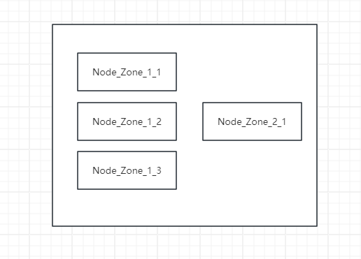

## Nodes:```/apiCenter/registry/node``` ```/apiCenter/registry/nodes```
```

type Nodes struct {
	nodes    []*Node
	zones    map[string][]*Node // order zone
	selfAddr string
}

type Node struct {
	c      *conf.Config
	client *http.Client

	pRegisterURL string
	registerURL  string
	renewURL     string
	cancelURL    string
	setURL       string

	zone      string
	addr      string
	status    model.NodeStatus
	otherZone bool
}

```
每一个Node可以理解为一个apiCenter服务的“指针”，Nodes用于管理这些Node



