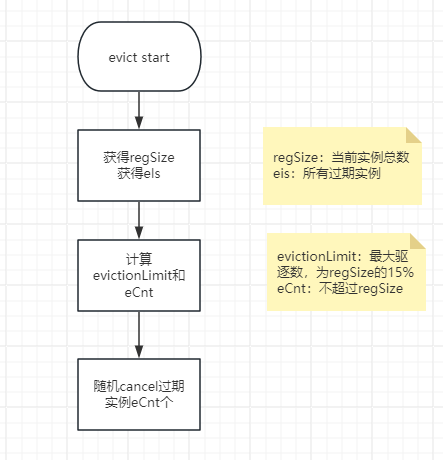
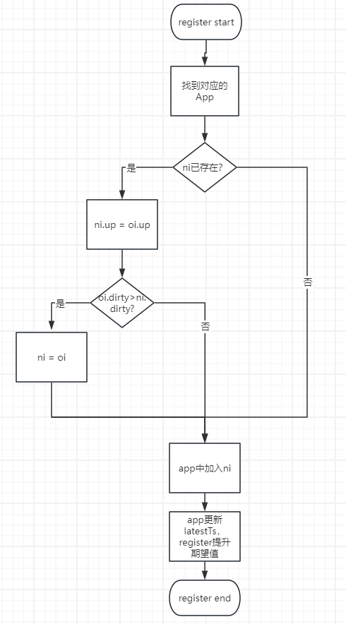
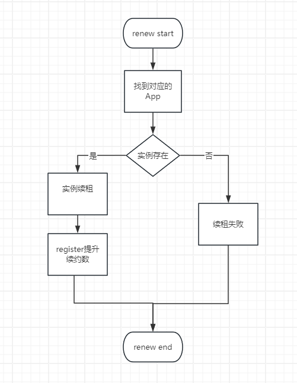
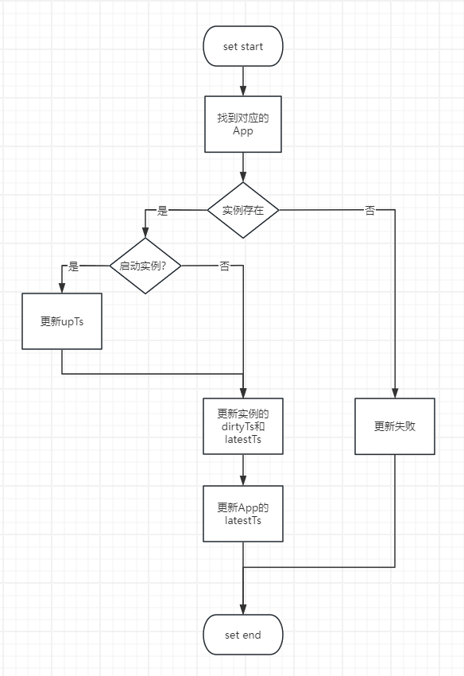
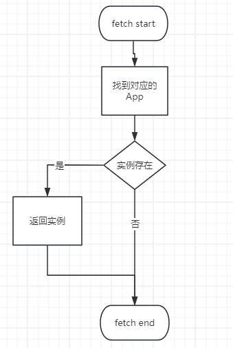
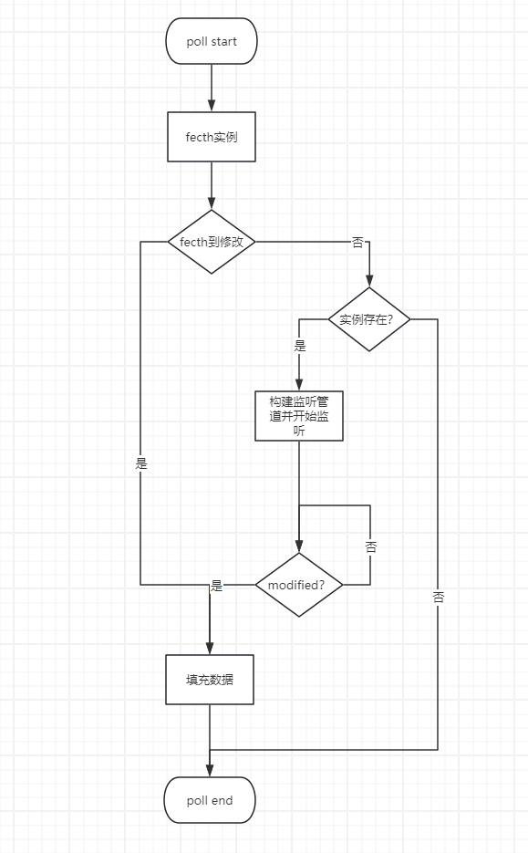
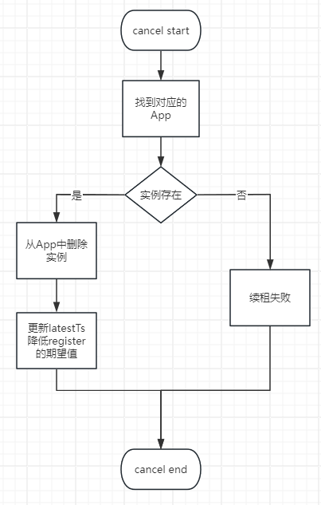

# 单实例的工作流程

## Register:
````

type Registry struct {
	appm  map[string]*model.Apps
	alock sync.RWMutex
   
    conns     map[string]*hosts // region.zone.env.appid-> host
	cLock     sync.RWMutex
	scheduler *scheduler
	gd        *Guard
}

type Apps struct {
	apps            map[string]*App
	lock            sync.RWMutex
	latestTimestamp int64   // 注册、设置、下线会更新该时间戳
}

type App struct {
	AppID     string                // 服务ID
	Zone      string                // 服务所在的机房
	instances map[string]*Instance  // 实例

	lock            sync.RWMutex   
	latestTimestamp int64           // 注册、设置、下线会更新该时间戳
}

type Instance struct {
	Region   string            `json:"region,omitempty"`
	Zone     string            `json:"zone,omitempty"`      // 所在机房
	Env      string            `json:"env,omitempty"`       // 环境
	AppID    string            `json:"app_id,omitempty"`    
	Hostname string            `json:"hostname,omitempty"`  // instance主机标识
	Addrs    []string          `json:"addrs,omitempty"`     // 
	Version  string            `json:"version,omitempty"`
	Metadata map[string]string `json:"metadata,omitempty"`

	Status uint32 `json:"status,omitempty"`     // 服务状态

    // 所有时间戳都是纳秒
	RegTimestamp   int64 `json:"reg_timestamp,omitempty"`     // 注册时间戳
	UpTimestamp    int64 `json:"up_timestamp,omitempty"`      // 最近一次启动时间戳
	RenewTimestamp int64 `json:"renew_timestamp,omitempty"`   // 上次续约时间戳
	DirtyTimestamp int64 `json:"dirty_timestamp,omitempty"`   // 注册、设置、续约会更新该时间戳

	LatestTimestamp int64 `json:"latest_timestamp,omitempty"` // 注册、设置、下线会更新该时间戳
}

````
- 实例信息都在Instance
- Zone、Env、AppID、Hostname可以理解为一个实例的UUID(Region暂未使用)
- App.instances的key是hostname
- Apps.apps的key是zone
- Apps和App都有latestTimestamp字段，该字段作为一个索引使用，即可以只拉取在latestTimestamp之后的实例。
- 定位一个实例的完整路径是：Registry.appm[appid-env].apps[zone].instances[hostname]

## Guard

```
type Guard struct {
	expPerMin    int64
	expThreshold int64
	facInMin     int64
	facLastMin   int64
	lock         sync.RWMutex
}

```
- guard是一个动态计算阈值类
- 每当有新实例注册的时候 ```expPerMin``` 的值会+2，每当有新实例下线的时候 ```expPerMin``` 的值会-2，expThreshold始终为```expPerMin```的0.85倍
- 每当有实例进行续约的时候 ```facInMin``` 的值就会+1，每一个注册中心的执行驱逐前会把这```facLastMin```的值置为```facInMin```，且把```facInMin```置为0.
- 当```expThreshold < facLastMin```时说明注册中心处于```protect```状态，在这个模式下允许一定程度的续约超时。

## Register的主流程
```

func (r *Registry) proc() {
	tk := time.Tick(1 * time.Minute)
	tk2 := time.Tick(15 * time.Minute)
	for {
		select {
		case <-tk:
			r.gd.updateFac()    // atomic.StoreInt64(&g.facLastMin, atomic.SwapInt64(&g.facInMin, 0))
			r.evict()           // 驱逐策略
		case <-tk2:
			r.resetExp()        // 重置guard
		}
	}
}

```
- 每分钟是一个小周期
 - 计算服务是否处于protect时使用上个小周期计算出来的值```g.facLastMin```
 - 先更新```g.facLastMin```再进行驱逐
- 每15分钟是一个大周期
 - 计算当前实例数量
 - 重新计算gd期望值


- 1分钟维护一次```facInMin和facLastMin```之后进行对过期实例的驱逐
- 15分钟重置一次```expPerMin,expThreshold```，新```expPerMin```为当前所有实例的总和乘以2

## 驱逐策略
- 注册中心会定期清理一些过期的实例


- 第一步：找到所有续租超时的实例```els```
- 第二步：计算最大可驱逐的实例数量 ```evictionLimit```，这里考虑到Go的GC会因为STW导致超时，所以每次都不会驱逐所有的过期实例而是只驱逐一部分。
- 第三步：从找到的所有过期实例(```els```)中随机下线```evictionLimit```个

## 注册实例
- 设ni为待注册的新实例，oi是可能存在的旧实例、up为服务实例启动的时间戳（纳秒），dirty是dirty操作时间戳（纳秒）


## 续租


## 更新实例
- 更新实例时若变更了实例状态，且新状态为启动时，则实例启动时间戳(upTs)也随之更新


## 拉取实例


## 监听实例

- 为了提升程序性能，在监听实例变化的地方做了以下的处理:
```
for i := range arg.AppID {
		k := pollKey(arg.Env, arg.AppID[i])
		r.cLock.Lock()
		if _, ok := r.conns[k]; !ok {
			r.conns[k] = &hosts{hosts: make(map[string]*conn, 1)}
		}
		hosts := r.conns[k]
		r.cLock.Unlock()

		hosts.hclock.Lock()
		connection, ok := hosts.hosts[arg.Hostname]
		if !ok {
			if ch == nil {
				ch = make(chan map[string]*model.InstanceInfo, 5) // NOTE: there maybe have more than one connection on the same hostname!!!
			}
			connection = newConn(ch, arg.LatestTimestamp[i], arg)
			log.Info("Polls from(%s) new connection(%d)", arg.Hostname, connection.count)
		} else {
			connection.count++ // NOTE: there maybe have more than one connection on the same hostname!!!
			if ch == nil {
				ch = connection.ch
			}
			log.Info("Polls from(%s) reuse connection(%d)", arg.Hostname, connection.count)
		}
		hosts.hosts[arg.Hostname] = connection
		hosts.hclock.Unlock()
	}

```
- 让多个监听同一个App的请求共用一个管道以提升性能

## 下线实例
